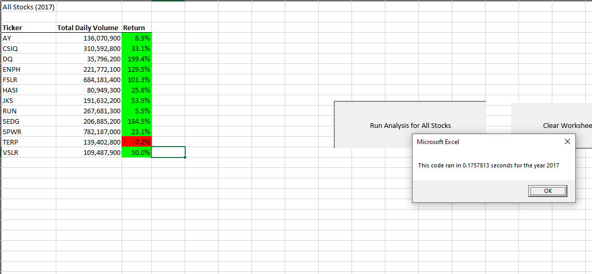
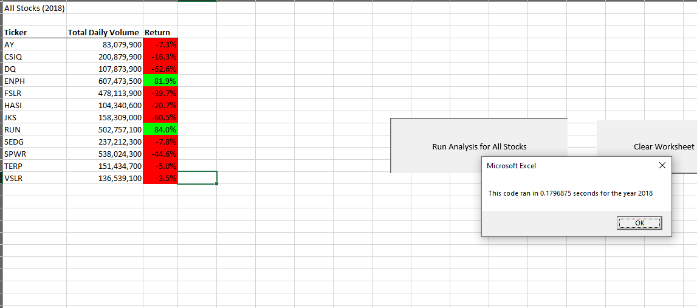

# VBA_Challenge
Module 2 Assignment VBA
## Excel Sheet: [VBA Challenge](VBA_Challenge.xlsm)

## Overview of Project
The purpose of this analysis was to deepen our understanding of programming logic and how we could use for loops and arrays in the refactor process.

## Results

When calculating the refactored time for the 2017 Worksheet the time that we got is 0.1757813 seconds. The time on the non refacotred worksheet is 0.9570313 second.

When calculating the refactored time for the 2017 Worksheet the time that we got is 0.1953125 seconds. The time on the non refacotred worksheet is 1 second.

The stock performance between the 2017 and 2018 refactored times are very close because both sheets have the same number of rows. The small difference in time could have been cause by other factors.
The reason the non refactored sheets were much slower than the refactored sheets is because the non refactored sheets go through the raw data multiple times while the refactored code goes through the raw data once, stores the values and then it is printed using the arrays from before.

## Summary
The advantages of refactoring code is that it gives us a chance to first make our code much cleaner such as getting rid of processes that overcomplicate a simple situation. It also lets us increase the effeciency of our code like in this case. The disadvanteges of refactoring could be the chance of introducing new errors and unforseen problems into the code which might destroy the flow of logic.

The advantages of the original code would be that its very easy to follow but the disadvantages is that it is very ineffecient espeically if you were to scale up. 
The advantages of the refactored code would be its effeciency and its ability to scale up because of the use of arrays. The disadvantage would be that it makes the code a bit harder to follow.

